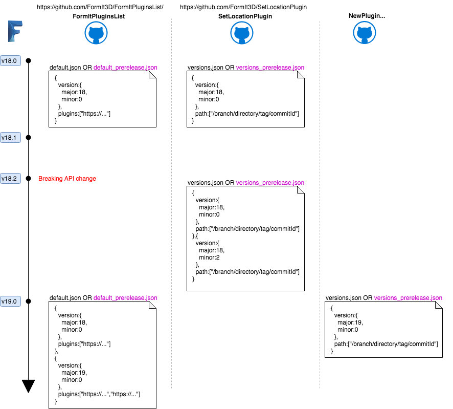

# SetLocationPlugin 

## Development

To make and test changes, non-released builds of FormIt clients will look at `versions_prerelease.json`.

During testing, you should not make any changes to directories which are not marked as `prerelease`, as this can affect live clients (Note: See `versions.json` for a list of directories which are used live). To be safe, you can create a new directory for any updates. 

To see your changes in FormIt non-release clients, update `versions_prerelease.json` with any directory changes.

## Releasing 

To release changes:

- Ensure they have been tested.
- Create a new (or use an existing) directory with any new changes to plugins and copy your changes from the pre-release directory (which you should have created during testing).
- Update `versions.json` to point to the updated (or new) plugin.